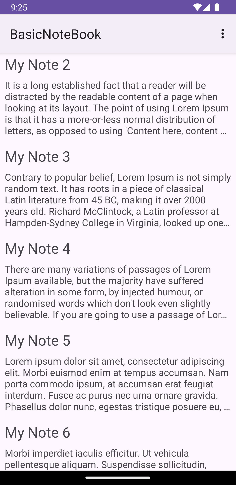
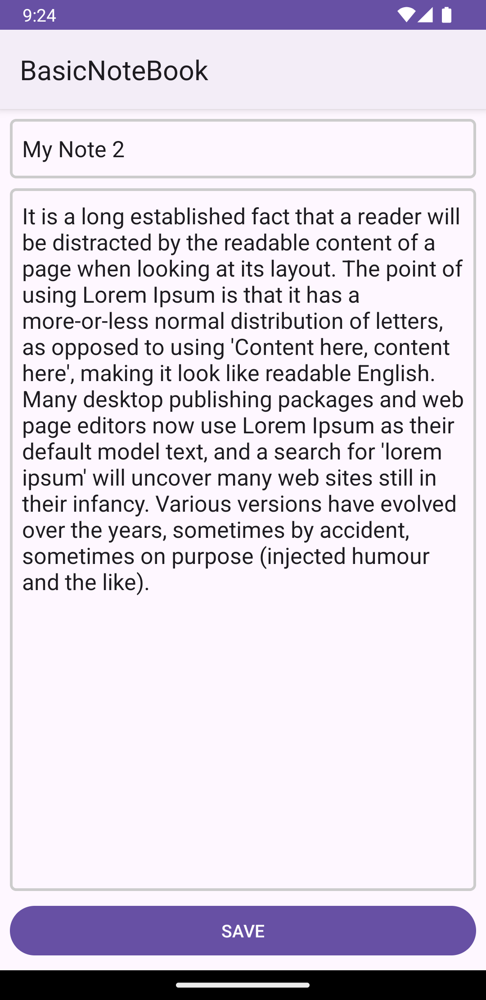
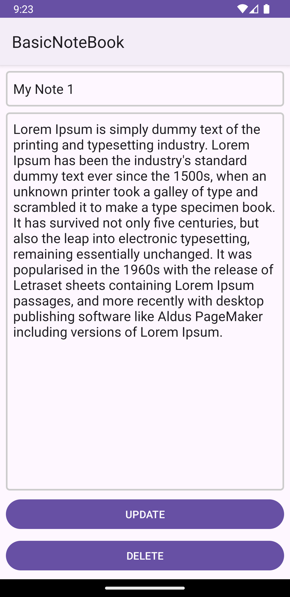

# BasicNoteBook (Kotlin İlk Uygulamam)

+ Kotlin öğrenirken yaptığım ilk uygulamamı paylaşmak istedim. BasicNoteBook, basit bir not tutma uygulamasıdır. Kullanıcı, başlık ve içerik bilgilerini girip yerel veritabanına kaydettiği notları istediği zaman görüntüleyebilir, değiştirebilir ve silebilir.

## Temel Özellikler:

+ Başlık ve içerik bilgileri girilip bir not yerel veritabanında kayıt altına alınabilir.
+ Oluşturulan notlar ana ekranda görüntülenebilir.
+ İstenilen not tekrardan düzenlenebilir.
+ İstenilmeyen not silinebilir.

## Kurulum:

    git clone https://github.com/cusufcan/basic_note_book

## Ekran Görüntüleri:

<table>
    <tr>
        <td></td>
        <td></td>
        <td></td>
    </tr>
</table>

## Kullanılan Teknolojiler:

+ Kotlin
+ ViewBinding
+ RxJava
+ Room
+ Menu

## Lisans:

    MIT

